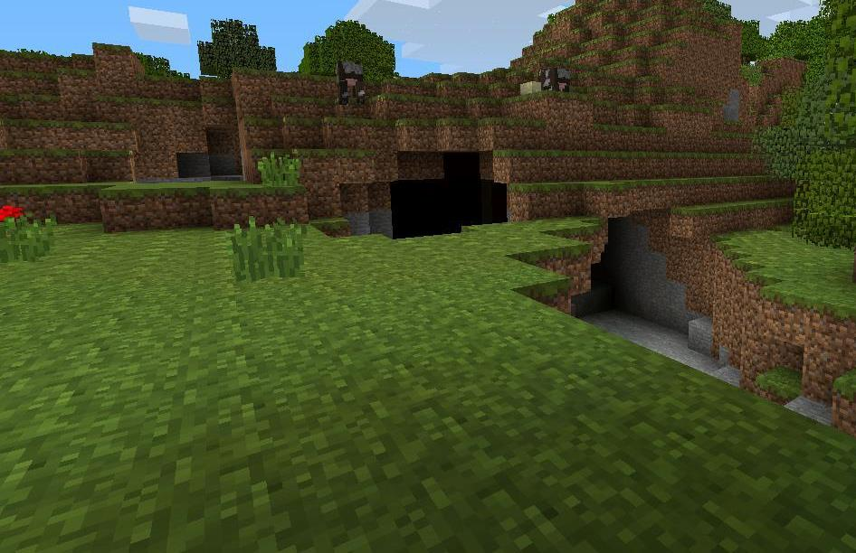

## Problem Description
Have you ever played the video game Minecraft? This game has been one of the world's most popular game in recent years. The world of Minecraft is made up of lots of 1×1×1 blocks in a 3D map. Blocks are the basic units of structure in Minecraft, there are many types of blocks. A block can either be a clay, dirt, water, wood, air, ... or even a building material such as brick or concrete in this game.



Figure 1: A typical world in Minecraft.


Nyanko-san is one of the diehard fans of the game, what he loves most is to build monumental houses in the world of the game. One day, he found a flat ground in some place. Yes, a super flat ground without any roughness, it's really a lovely place to build houses on it. Nyanko-san decided to build on a n×m big flat ground, so he drew a blueprint of his house, and found some building materials to build.

While everything seems goes smoothly, something wrong happened. Nyanko-san found out he had forgotten to prepare glass elements, which is a important element to decorate his house. Now Nyanko-san gives you his blueprint of house and asking for your help. Your job is quite easy, collecting a sufficient number of the glass unit for building his house. But first, you have to calculate how many units of glass should be collected.

There are n rows and m columns on the ground, an intersection of a row and a column is a 1×1 square,and a square is a valid place for players to put blocks on. And to simplify this problem, Nynako-san's blueprint can be represented as an integer array ci,j(1≤i≤n,1≤j≤m). Which ci,j indicates the height of his house on the square of i-th row and j-th column. The number of glass unit that you need to collect is equal to the surface area of Nyanko-san's house(exclude the face adjacent to the ground).
 

## Input
The first line contains an integer T indicating the total number of test cases.
First line of each test case is a line with two integers n,m.
The n lines that follow describe the array of Nyanko-san's blueprint, the i-th of these lines has m integers ci,1,ci,2,...,ci,m, separated by a single space.

1≤T≤50
1≤n,m≤50
0≤ci,j≤1000
 

## Output
For each test case, please output the number of glass units you need to collect to meet Nyanko-san's requirement in one line.
 

## Sample Input
```
2
3 3
1 0 0
3 1 2
1 1 0
3 3
1 0 1
0 0 0
1 0 1
```

## Sample Output
```
30
20
```