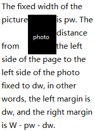

## Problem Description
Yellowstar is writing an article that contains N words and 1 picture, and the i-th word contains ai characters.
The page width is fixed to W characters. In order to make the article look more beautiful, Yellowstar has made some rules:

1. The fixed width of the picture is pw. The distance from the left side of the page to the left side of the photo fixed to dw, in other words, the left margin is dw, and the right margin is W - pw - dw.
2. The photo and words can't overlap, but can exist in same line.
3. The relative order of words cannot be changed.
4. Individual words need to be placed in a line.
5. If two words are placed in a continuous position on the same line, then there is a space between them.
6. Minimize the number of rows occupied by the article according to the location and height of the image.



However, Yellowstar has not yet determined the location of the picture and the height of the picture, he would like to try Q different locations and different heights to get the best look. Yellowstar tries too many times, he wants to quickly know the number of rows each time, so he asked for your help. It should be noted that when a row contains characters or pictures, the line was considered to be occupied.

 Yellowstar 正在写一篇包含 N 个单词和 1 张图片的文章，第 i 个单词包含 ai 字符。
页面宽度固定为 W 字符。为了使文章看起来更漂亮，Yellowstar 制定了一些规则：

1. 照片的固定宽度为 pw。从页面左侧到照片左侧的距离固定为 dw, 换句话说，左边距为 dw, 右边距为 W-pw-dw。

2. 照片和文字不能重叠，但可以存在于同一行。

3. 词语的相对顺序不能改变。

4. 单个单词需要放在一行。

5. 如果两个词被放在同一行的连续位置，那么它们之间存在空间。

6. 根据图片的位置和高度，尽量减少文章占用的行数。

然而，Yellowstar 还没有确定图片的位置和高度，他想尝试 Q 不同的位置和高度来获得最佳效果。Yellowstar 尝试了太多次，他想快速知道每次的行数，所以他请求你的帮助。需要注意的是，当一行包含人物或图片时，该行被认为是被占用的。

## Input
The first line of the input gives the number of test cases T; T test cases follow.
Each case begins with one line with four integers N, W, pw, dw : the number of words, page width, picture width and left margin.
The next line contains N integers ai, indicates i-th word consists of ai characters.
The third line contains one integer Q.
Then Q lines follow, each line contains the values of xi and hi, indicates the starting line and the image height of the image.

输入的第一行给出了测试用例 T 的数量；T 之后是测试用例 T。
每个测试用例以一行开始，该行包含四个整数 N、W、pw、dw: 字数、页面宽度、图片宽度和左页边距。
下一行包含 N 个整数 ai, 表示第 i 个单词由 ai 字符组成。
第三行包含一个整数 Q。
然后是 Q 行，每行包含 xi 和 hi 的值，表示起始行和图像的高度。

### Limits
T≤10

1≤N,W,Q≤105

1≤pw,ai≤W

0≤dw≤W−pw
 

## Output
For each query, output one integer denotes the minimum number of rows.
 
对于每个查询，输出一个整数表示最小行数。

## Sample Input
```
2
2 7 4 3
1 3
3
1 2
2 2
5 2
3 8 2 3
1 1 3
1
1 1
```

## Sample Output
```
2
3
3
1
```

## Solution
整片文章可以被分成2部分：①中间没有图片的部分；②中间插有图片的部分

可以将这2部分分别用ST离线，f[i][j]表示以第i个单词开始，连续1 << j行能写多少单词。要注意的是：在第②部分中，如果第一个单词的宽度大于dw和w-pw-dw的话，那么这一段

```
int f1[MX][30]; // 普通行的稀疏表：从第i个单词开始，占用1<<j行能容下的单词数
int f2[MX][30]; // 图片行的稀疏表：从第i个单词开始，占用1<<j行图片行能容下的单词数
```

要用快读

```cpp
int RMQ1(int s)
{
    int ans=0;
    while(s<=n)
    {
        int j=0;
        while((1<<(j+1))<=n&&s+f1[s][j+1]<=n)j++;
        s+=f1[s][j];
        ans+=(1<<j);
    }
    return ans;
}
int RMQ2(int s,int h)
{
    if(h==0)return s;
    while(h&&s<=n)
    {
        int j=0;
        while((1<<(j+1))<=h)j++;
        s+=f1[s][j];
        h-=(1<<j);
    }
    return s;
}
int RMQ3(int s,int h)
{
    if(h==0)return s;
    while(h&&s<=n)
    {
        int j=0;
        while((1<<(j+1))<=h)j++;
        s+=f2[s][j];
        h-=(1<<j);
    }
    return s;
}
```